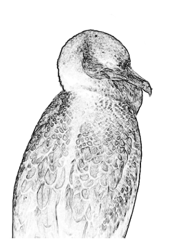
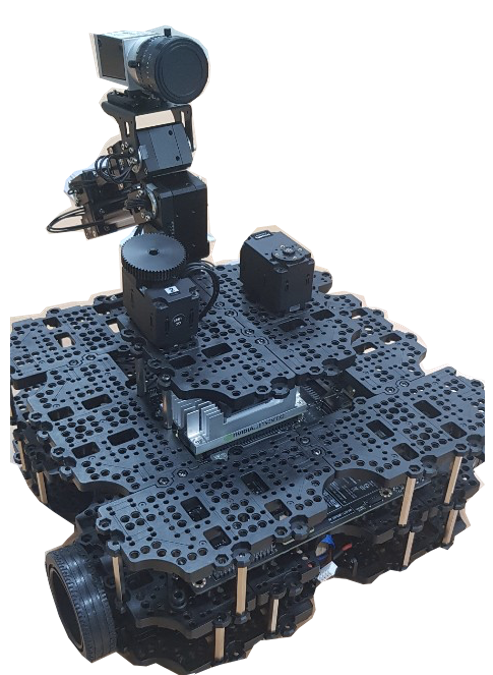

# ROS Galapagos Cormorant



This `Galapagos_cormorant` project is for developing a ROS package for industrial-camera autofocusing solution. With a [OpenMANIPULATOR-X](http://emanual.robotis.com/docs/en/platform/openmanipulator_x/overview/) and a[Turtlebot3 Waffle](http://emanual.robotis.com/docs/en/platform/turtlebot3/overview/), [Basler Ace acA2500-14gm](https://www.baslerweb.com/ko/products/cameras/area-scan-cameras/ace/aca2500-14gm/) camera focuses an having QR Code object dynamically. Feel free to contact [Ricky](kjhricky@gmail.com).

본 `갈라파고스 가마우지`는 산업용 카메라 오토포커싱 수행 ROS 패키지 개발을 위한 프로젝트입니다. [오픈매니퓰레이터X](http://emanual.robotis.com/docs/en/platform/openmanipulator_x/overview/)와 [터틀봇3 와플](http://emanual.robotis.com/docs/en/platform/turtlebot3/overview/)을 이용하여 [Basler Ace acA2500-14gm](https://www.baslerweb.com/ko/products/cameras/area-scan-cameras/ace/aca2500-14gm/) 카메라가 QR 코드를 가진 피사체를 동적으로 인식합니다. 문의사항은 언제든지 [다음 이메일](kjhricky@gmail.com)에 남겨 주세요.

> This project document is in progress. The whole description will be written soon.

## Quickstart

1. [SBC] Install [ROS melodic](http://wiki.ros.org/melodic/Installation/Ubuntu)

1. [SBC] Create catkin workspace

   ```bash
   mkdir -p ~/catkin_ws/src
   cd ~/catkin_ws/
   catkin_make
   ```

1. [SBC] Clone `Pylon ROS Camera` packages on catkin workspace

   ```bash
   cd ~/catkin_ws/src/
   git clone https://github.com/basler/pylon-ros-camera
   ```

1. [SBC] Clone `ROS Galapagos Cormorant` on any directory except catkin workspace

   ```bash
   cd ~
   git clone https://github.com/100kimch/ros_galapagos_cormorant
   ```

1. [SBC] Run `scripts/cp_catkin.sh` which copy packages and do `catkin_make`

   ```bash
   bash ~/ros_galapagos_cormorant/scripts/cp_catkin.sh
   ```

1. [SBC] Run roscore. Make sure you've set IP configuration by `export ROS_MASTER_URI`

   ```bash
   roscore
   ```

1. [SBC] Launch pylon_camera_node.launch

   ```bash
   roslaunch pylon_camera pylon_camera_node.launch
   ```

1. [SBC] Launch image_analyzer.launch in other terminal

   ```bash
   roslaunch ml-learning image_analyzer.launch
   ```

- Now, your analyzed CSV file will be in `assets/data/<datetime>.csv` for controlling robot and industrial camera, see below descriptions.

## Overview

- **This project include:**
  - 2000+ captured images of focusing at least three QR codes
  - ROS launch for image crawling, image analyzing, machine learning and robot controlling
  - customized arduino board driver to control 8 motors
  - online learning package will be uploaded

## File Systems

- `assets/` has various types of assets
  - `data/` has csv files made by `image_analyzer.launch`
  - `images/` has captured images to analyze
    - `3-codes/` has captured images with 3 QR codes(1x1, 3x3, 5x5)
    - `5-codes/` has captured images with 5 QR codes(1x1, 2x2, 3x3, 4x4, 5x5)
  - `scripts/`:
    - `cp_catkin.sh` helps to set up an enviroment to run this project.
    - `load_catkin.sh`
- `docs/` has documents and manuals to help using & downloading this project.
- `packages/` includes ROS packages developed
  - `ml-learning` is a beta package to image crawling and learning

> For more information about ROS packages themselves, See: [Wiki: Package Structure]

## Hardware Configurations



### Hardware Specification

- Turtlebot3 Waffle
  - 281 x 306 x 141 mm
  - 30kg maximum payload
  - SBC: Raspberry Pi 3 Model B+
  - OpenCR Arduino + Dynamixel Motor 2EA
  - [Turtlebot3 eManual](http://emanual.robotis.com/docs/en/platform/turtlebot3/overview/)
- OpenMANIPULATOR-X

  - Injection Molding Parts
  - Aluminum-frame arms
  - [openMANIPULATOR-X eManual](http://emanual.robotis.com/docs/en/platform/openmanipulator_x/overview/)

- NVIDIA Jetson TX2
  - ARM A57 with CUDA GPU
  - 8GB DDR + 64GB Flash
  - 32GB eMMC
  - Linux for Tegra
  - [Jetson TX2 Description](https://www.nvidia.com/ko-kr/autonomous-machines/embedded-systems/)
- Basler Ace acA2500-14gm
  - 2592 x 1944 5MP resolution
  - MONO tone
  - 14fps
  - [acA2500-14gm Description](https://www.baslerweb.com/ko/products/cameras/area-scan-cameras/ace/aca2500-14gm/)
